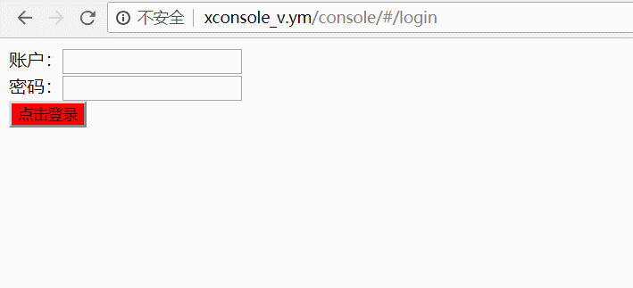

### Vue+vue-router+Webpack4模拟登陆跳转和嵌套路由功能（非vue-cli）  
#### Webpack实现的功能
> * 打包和输出html
> * 打包，分离，压缩和输出css文件
> * vue模板解析
> * 自定义输出js文件路径和名称等

#### demo的基本功能
> * 使用vue-router模拟登陆和跳转
> * vue-router嵌套路由模拟登陆后切换页面

### package.json配置
```json
{
  "name": "sntdata2",
  "version": "1.0.0",
  "main": "index.js",
  "dependencies": {
    "babel-core": "^6.26.3",
    "babel-loader": "^7.1.5",
    "vue": "^2.5.17",
    "vue-loader": "^15.4.0",
    "vue-router": "^3.0.1",
    "vue-template-compiler": "^2.5.17"
  },
  "devDependencies": {
    "css-loader": "^1.0.0",
    "html-webpack-plugin": "^3.2.0",
    "mini-css-extract-plugin": "^0.4.2",
    "optimize-css-assets-webpack-plugin": "^5.0.0",
    "style-loader": "^0.22.1",
    "webpack": "^4.17.1",
    "webpack-cli": "^3.1.0"
  },
  "scripts": {
    "test": "echo \"Error: no test specified\" && exit 1",
    "dev": "webpack --config=config/webpack.dev.js"
  },
  "author": "",
  "license": "ISC",
  "keywords": [],
  "description": ""
}
```

### 项目运行
```
npm install
npm run dev
```
### 运行环境
> * 需要单独配置服务器运行

### 效果图

